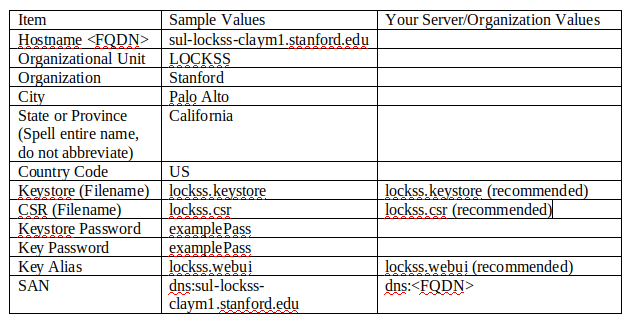
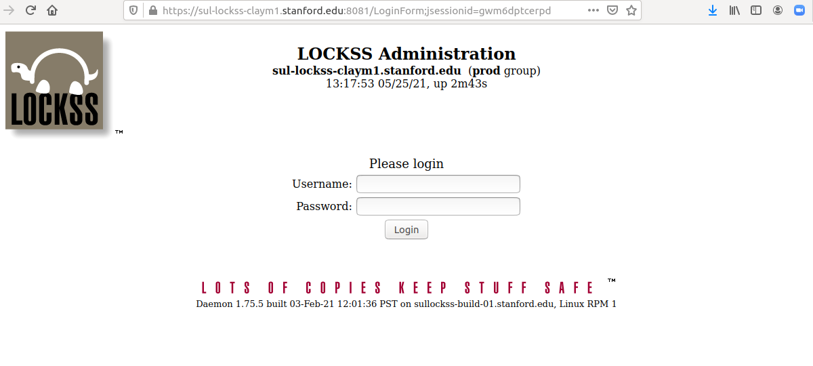

To get back to the Classic LOCKSS system manual use [this link](./index.md)

### Overview

This document takes a look at the steps needed to secure the LOCKSS admin interface with an InCommon SSL Certificate. The examples in this document were done on CentOS 7 with OpenJDK version 8 (java).

### Getting Started

The first thing you must do is gather information regarding your server and your organization. This information is used to create the Keystore and Key pair, which is then used to create a CSR (Certificate Signing Request). Below is a picture of a chart used to gather this information. Some of the fields have recommended values prepopulated.



_Please do NOT use “examplePass” as your Keystore and Key password. It is only shown here as an example. However, We do suggest keeping the Keystore password and the Key password the same for simplicity (You could make them two different passwords if you choose, or if your organization suggests doing so)._

### Prepare your working Directory

First, you must create a place to create a Keystore, and eventually generate a CSR. In this example, we will use the directory /root/ssl which must be created. Log into your LOCKSS box, gain root access, and create the /root/ssl directory using ``mkdir``.

```
[root@sul-lockss-claym1]# mkdir /root/ssl
[root@sul-lockss-claym1]# cd /root/ssl
[root@sul-lockss-claym1 ssl]#
```

### Generate the Keystore, Key Pair, and CSR

The ``keytool`` command is used to generate the Keystore, the Key pair, and the CSR. We have provided a shell script in order to simplify the process and save you time. Create a file named mkcsr.sh, and add the following contents to it.

_Please note the values that need to be changed in the "Setup" section immediatley below._

``` bash
#!/bin/bash
###########################
# 1. Setup
#
# Only these values need to be customized using info gathered
##########################
# Certificate Parameters
HOST="sul-lockss-claym1.stanford.edu"    #replace with your hostname
UNIT="LOCKSS"                            #replace with your OU
ORGANIZATION="Stanford"                  #replace with your Org
CITY="Palo Alto"                         #replace with your city
STATE="CA"                               #replace with your state
COUNTRY="US"                             #replace with your country
# Keystore and Key Password
PASSWORD="examplePass"                   #replace with your password
# Keystore Filename
KEYSTORE="lockss.keystore"               #leave as is
# Keystore Alias
ALIAS=lockss.webui                       #leave as is
# CSR Filename
CSR=lockss.csr                           #leave as is
###########################
# 2. Run
#
# Creates Keystore and CSR file
##########################
# Cleanup data files from past runs
rm -f $KEYSTORE $CSR
# Generate keystore
echo ".... generating keystore"
keytool -genkeypair -noprompt \
  -keystore $KEYSTORE -storetype jceks -alias $ALIAS \
  -storepass $PASSWORD -keypass $PASSWORD \
  -keyalg RSA -keysize 2048 \
  -dname "CN=$HOST, OU=$UNIT, O=$ORGANIZATION, L=$CITY, S=$STATE, C=$COUNTRY" \
  -ext SAN=dns:$HOST
echo
# Generate CSR
echo ".... generating CSR"
keytool -certreq -noprompt \
  -keystore $KEYSTORE -storetype jceks -alias $ALIAS \
  -storepass $PASSWORD -keypass $PASSWORD \
  -ext SAN=dns:$HOST \
  -file $CSR
echo
###########################
# 3. Results
#
# Report results
##########################
echo ".... Results:"
echo "Initialized keystore name is $KEYSTORE"
echo "CSR ready for submission is $CSR"
echo
# Print CSR
echo ".... printing CSR"
keytool -printcertreq -file $CSR -v
```

Once the file has been created, and the sample values have been changed, use ``bash`` to run the command.

```bash
[root@sul-lockss-claym1 ssl]# bash mkcsr.sh
.... generating keystore

Warning:
The JCEKS keystore uses a proprietary format. It is recommended to migrate to PKCS12 which is an industry standard format using "keytool -importkeystore -srckeystore lockss.keystore -destkeystore lockss.keystore -deststoretype pkcs12".

.... generating CSR

Warning:
The JCEKS keystore uses a proprietary format. It is recommended to migrate to PKCS12 which is an industry standard format using "keytool -importkeystore -srckeystore lockss.keystore -destkeystore lockss.keystore -deststoretype pkcs12".

.... Results:
Initialized keystore name is lockss.keystore
CSR ready for submission is lockss.csr

.... printing CSR
```
_There will be more output but I have truncated it for brevity. It is also worth noting that the warnings above should be ignored. We are currently working on integrating PKCS12 keystores, but for now we only support JCEKS_

The ``ls`` command now shows us three files.

```
[root@sul-lockss-claym1 ssl]# ls 
lockss.csr lockss.keystore mkcsr.sh
```

### Request the InCommon certificate

Using a web browser navigate to the InCommon SSL Certificate request form that your institution recommends and fill in the appropriate information. 

**IMPORTANT** - LOCKSS is a Java Web Server. You must specify the "Server Type" as "Java Web Server (Javasoft/Sun)" on your InCommon SSL request form.

Paste the contents of your CSR file into the appropriate spot. Use the ``cat`` command to view the contents of the lockss.csr file, and then use your mouse to highlight everything within the CSR. This includes the lines "-----BEGIN NEW CERTIFICATE REQUEST-----" and "-----END NEW CERTIFICATE REQUEST-----".

```
[root@sul-lockss-claym1 ssl]# cat lockss.csr 
-----BEGIN NEW CERTIFICATE REQUEST-----
MIIDGzCCAgMCAQAwezELMAkGA1UEBhMCVVMxCzAJBgNVBAgTAkNBMRIwEAYDVQQH
EwlQYWxvIEFsdG8xETAPBgNVBAoTCFN0YW5mb3JkMQ8wDQYDVQQLEwZMT0NLU1Mx
JzAlBgNVBAMTHnN1bC1sb2Nrc3MtY2xheW0xLnN0YW5mb3JkLmVkdTCCASIwDQYJ
KoZIhvcNAQEBBQADggEPADCCAQoCggEBAL9e1Ol35aMF9V7LOfvCIqZBgRquTkDl
0gjNO6v4E/R/zAGYtsPtRooURBtw9jY1uIuTL+ftBSi0pXKVK+4iheQfMkRHuZZW
/W36SL+JWNAmkKN8f0kPIgioUtkTqm0Ei8m7U6XOK5eIDm3jMyXVgSABt3Dt0Iq+
Yer2smrlB3Gak1wTF0XDOS3B7Kf1Ash7Nqci3rxnRPiX/dJXZ64DvyOsaogMzZEL
TgU3Z/q8CTt0GMlp7pL4zze0SBXpyJMSNQqZdaR7Fwa9d9O+pg2vfgJYEQVL/1RZ
Aa44odS5XNn0LZTiXZl3S8Owxgt4HXwlVLT9Emvq1WxE7OJa/ybsLIcCAwEAAaBb
MFkGCSqGSIb3DQEJDjFMMEowKQYDVR0RBCIwIIIec3VsLWxvY2tzcy1jbGF5bTEu
c3RhbmZvcmQuZWR1MB0GA1UdDgQWBBR8D5EuDRKcJWo0XUkjg3Izz44GrDANBgkq
hkiG9w0BAQsFAAOCAQEAEM4jNFQyT1+jNg3c3XDMx+RMaVhkvBsbpfMlJ5LAQV+k
S7wRiBM+6JqrBehprpLwfDLkKaTAihz9KT7ya8vVmVV9EUrY3TQL0pXWbBz6bCDl
gfJu5ofYfLHSV9MgH6g5koegNVp9LSM/rE8P9O/vIAkKKMwQs1OyXhUcOHcglVlD
w+GzEH1dYXY/VGMMwts1TQIQORkoQTlnxkhkqB+t9M81KQnsNFuN1J1fMKlAbzwN
cjoE0YZR9rgEUfP5XuCAbAOFEzYNxm1Cq3VIYBOP+MtCfsQr0Jwctc62fPo6I4zr
FFX6iQktA68D7gleg7wxH/3vILzjhIIAZl8o04PJpA==
-----END NEW CERTIFICATE REQUEST-----
```

### Download the Server, and Intermediate Certificates Using Curl

Incommon will send you an email containing URLs to your certificates. There may be multiple URLS and certificate types but we only want the X.509 certificates (Usually the first two in the email).

The first X.509 certificate is the "server certificate", and the second one contains the "intermediate" and "root" certificates.

Instead of downloading the certificates to your machine and transfering them to the server, we recommend using curl from the server to download the files.

```
[root@sul-lockss-claym1]# cd /root/ssl   #if not already there
[root@sul-lockss-claym1 ssl]# curl -o server.cert "<server cert URL from email>"
[root@sul-lockss-claym1 ssl]# curl -o other.cert "<intermediate cert URL from email>"
```
You will now have a server.cert file and a other.cert file in your working directory

```
[root@sul-lockss-claym1 ssl]# ls
lockss.csr lockss.keystore other.cert server.cert
```

### Split "other.cert" Into Two Certs

**Important** - Now that we have our certificates from InCommon, we have to import them into our keystore using the ``keytool`` command again. The only issue is that ``keytool`` is only capable of importing one certificate at a time.

As we mentioned, our newly downloaded certificate "other.cert" contains a root certificate, and multiple intermediate certificates. Using ``cat`` you can see all three certificates delineated by the strings "-----BEGIN CERTIFICATE-----" and "-----END CERTIFICATE-----".

```
[root@sul-lockss-claym1 ssl]# cat other.cert 
-----BEGIN CERTIFICATE-----
(certificate information deleted from this example for brevity)
(certificate information deleted from this example for brevity)
-----END CERTIFICATE-----
-----BEGIN CERTIFICATE-----
(certificate information deleted from this example for brevity)
(certificate information deleted from this example for brevity)
-----END CERTIFICATE-----
-----BEGIN CERTIFICATE-----
(certificate information deleted from this example for brevity)
(certificate information deleted from this example for brevity)
-----END CERTIFICATE-----
```

The first certificate listed in "other.cert" is the root certificate which we do _not_ need because there is already a root certificate that is installed with OpenJDK (Java). 

We need the second, and the third certificate within our "other.cert" file as they are the intermediate certificates. 

Just as we did when generating the CSR, use the ``cat`` command to view the contents of "other.cert", and then copy and paste the middle certificate into a new file called "intermediate1.cert". Now copy and paste the third certificate into a file named "intermediate2.cert". Be sure to include the "-----BEGIN CERTIFICATE-----" and "-----END CERTIFICATE-----" portions of the certificates. It is critical that the naming convention be followed here, so our next script will run without error.

Our working directory should now contain the following.

```
[root@sul-lockss-claym1 ssl]# ls
intermediate1.cert intermediate2.cert lockss.csr lockss.keystore other.cert server.cert
[root@sul-lockss-claym1 ssl]# 
[root@sul-lockss-claym1 ssl]# cat intermediate1.cert 
-----BEGIN CERTIFICATE-----
(certificate information deleted from this example)
-----END CERTIFICATE-----
[root@sul-lockss-claym1 ssl]# 
[root@sul-lockss-claym1 ssl]# cat intermediate2.cert
-----BEGIN CERTIFICATE-----
(certificate information deleted from this example)
-----END CERTIFICATE-----
```

_As stated above, it is critical that the naming conventions for the ".cert" file names are followed. At this point there should be a "server.cert" file, an "intermediate1.cert" file, and an "intermediate2.cert" file._

### Import Certificates into Keystore

**Important** - Importing the certificates permanently alters the keystore. This means that if the keystore becomes corrupted you will have to restart this entire process. We highly recommend making a copy of your keystore by doing the following.

```
[root@sul-lockss-claym1 ssl]# cp lockss.keystore lockss.keystore.bak
```

Once you have made a backup of your keystore we can begin importing the certificates. We will start with the intermediate certificates, and import the server.cert certificate last.

We have provided another script to save time and simplify this process. Create a file named "importcert.sh" and add the following contents to it

```bash
#!/bin/bash
###########################
# 1. Setup
#
# Only these values need to be customized using info gathered
# You need this portion to be exactly as it was in the mkcsr.sh file
##########################
# Certificate Parameters
HOST="sul-lockss-claym1.stanford.edu"    #replace with your hostname
UNIT="LOCKSS"                            #replace with your OU
ORGANIZATION="Stanford"                  #replace with your Org
CITY="Palo Alto"                         #replace with your city
STATE="CA"                               #replace with your state
COUNTRY="US"                             #replace with your country
# Keystore and Key Password
PASSWORD="examplePass"                   #replace with your password
# Keystore Filename
KEYSTORE="lockss.keystore"               #leave as is
# Keystore Alias
ALIAS=lockss.webui                       #leave as is
# CSR Filename
CSR=lockss.csr                           #leave as is
###########################
# 2. Import
#
# Import Certs
##########################
# Import Cert
echo ".... importing root cert"
keytool -import -trustcacerts \
  -file intermediate1.cert -alias intermediate1 \
  -keystore $KEYSTORE -storetype jceks \
  -storepass $PASSWORD \
  -ext SAN=dns:$HOST
echo

# Import Cert
echo ".... importing intermediate cert"
keytool -import -trustcacerts \
  -file intermediate2.cert -alias intermediate2 \
  -keystore $KEYSTORE -storetype jceks \
  -storepass $PASSWORD \
  -ext SAN=dns:$HOST
echo

# Import Cert
echo ".... importing server cert"
keytool -import -trustcacerts \
  -file server.cert -alias $ALIAS \
  -keystore $KEYSTORE -storetype jceks \
  -storepass $PASSWORD \
  -ext SAN=dns:$HOST
echo
```
Once you have replaced all of the sample values in the setup section above, you can run the file using ``bash``

```bash
[root@sul-lockss-claym1 ssl]# bash importcert.sh 
.... importing root cert
Certificate was added to keystore

Warning:
The JCEKS keystore uses a proprietary format. It is recommended to migrate to PKCS12 which is an industry standard format using "keytool -importkeystore -srckeystore lockss.keystore -destkeystore lockss.keystore -deststoretype pkcs12".

.... importing intermediate cert
Certificate was added to keystore
```

### Install the "lockss.keystore" File

We can now install the lockss.keystore file by copying it to /etc/lockss/. We must also change the permissions of it so that it is readible by the lockss linux ID.

```
[root@sul-lockss-claym1 ssl]# cp lockss.keystore /etc/lockss/
[root@sul-lockss-claym1 ssl]# chmod 444 /etc/lockss/lockss.keystore
```

### Create the LOCKSS SSL Configuration File

Create the file /etc/lockss/adminssl.txt and input the following contents.

_We will be replacing the values that are preceded with a "$" with the values that we collected previously. We will be inserting the keystore alias twice, the keystore filename, and the keystore password._

```
org.lockss.accounts.policy=ssl
org.lockss.ui.sslKeystoreName=$KEYSTOREALIAS
org.lockss.keyMgr.keystore.ks1.name=$KEYSTOREALIAS
org.lockss.keyMgr.keystore.ks1.file=/etc/lockss/$KEYSTORE
org.lockss.keyMgr.keystore.ks1.keyPassword=$KEYSTOREPASSWORD
```

Using our example values, our adminssl.txt file would contain the following.

```
[root@sul-lockss-claym1 ssl]# cat /etc/lockss/adminssl.txt
org.lockss.accounts.policy=ssl 
org.lockss.ui.sslKeystoreName=lockss.webui
org.lockss.keyMgr.keystore.ks1.name=lockss.webui
org.lockss.keyMgr.keystore.ks1.file=/etc/lockss/lockss.keystore
org.lockss.keyMgr.keystore.ks1.keyPassword=examplePass
```

### Modify LOCKSS Startup Options

The adminssl.txt file must be added to the LOCKSS startup configuration. This is done by appending ``-p /etc/lockss/adminssl.txt`` to the LOCKSS_PROPS_URL setting in "/etc/lockss/config.dat". Open the file "/etc/lockss/config.dat", and ensure that the entire string is between the double quotes.

Before
```
LOCKSS_PROPS_URL="http://props.lockss.org:8001/daemon/lockss.xml"
```
After
```
LOCKSS_PROPS_URL="http://props.lockss.org:8001/daemon/lockss.xml -p /etc/lockss/adminssl.txt"
```

### Restart LOCKSS and Login

Restart LOCKSS wih ``systemctl restart lockss`` and view the output of /var/log/lockss/daemon. If there is an issue with the configuration, there should be an error and stack trace within the first 60 seconds. 

If there are no obvious errors, try to access the URL of your LOCKSS box, but this time using the prefix "https" rather than "http". Using our example, I would navigate to "https://sul-lockss-claym1.stanford.edu:8081". 

The login dialog with an SSL certificate is different from what you have seen before. Instead of a browser-supplied authentication window you’ll see a LOCKSS-supplied Login screen that looks like this:


