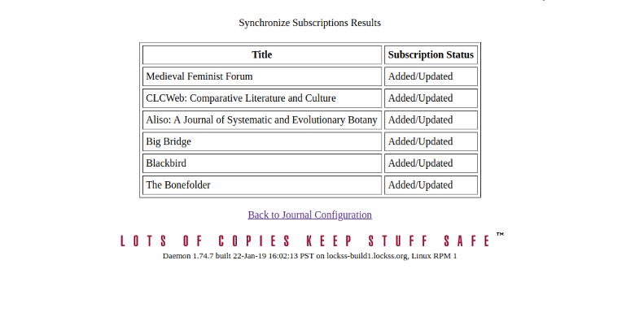
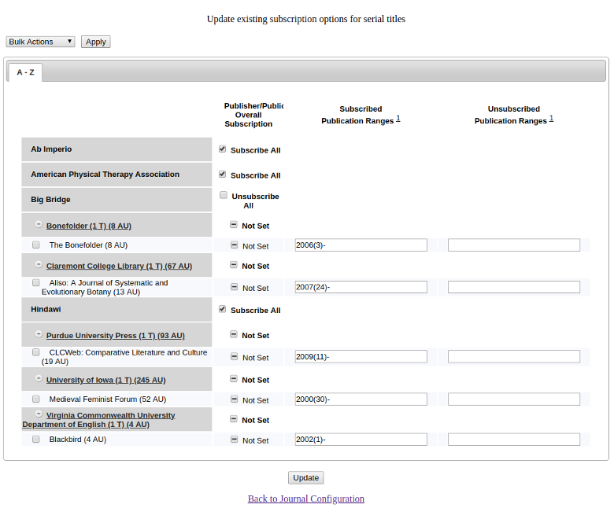

To get back to the Classic LOCKSS system manual use [this link](../index.md)

### Overview

This document takes a look at various ways to configure the Subscription Manager in order to efficiently
subscribe to serial publications.

_Please note that the terms **Configuration Management** and **Configuration Manager** will be used interchangeably throughout this document_

### Getting Started

The first thing you must do is navigate to the **Journal Configuration** page. You can access this page through a link on the main menu and a link on the sidebar menu: Both of those links can be seen in the picture of the _homepage_ below

Once inside of the Journal Configuration page, you will find three links related to Subscription Management.
- **Add Titles to Subscription Management** – It allows the user to add new serial publication subscriptions.
- **Update Existing Subscription Options** – It allows the user to modify existing serial publication subscriptions. This link will not be shown when no subscriptions are currently specified, as is the case initially.
- **Synchronize Subscriptions** – It allows the user to ask the LOCKSS software to create subscriptions based on the currently configured Archival Units.

_The links can be seen in the image below_

The next three sections will explain the links related to Subscription Management in the order they are listed

### Add Titles to Subscription Management

After clicking on the **Add Titles to Subscription Management** link you will be taken to page like the one below.

This page uses a tabbed interface in which the publishers are listed alphabetically based on the first letter of the publisher name.

Only publishers with publications for which no subscription has been specified will appear in this page.

Initially, each table row shows the publisher name, followed by the number of its serial publications with no subscriptions in parentheses and preceded by an icon with the + sign. We then see a column labeled **Publisher/Publication Overall Subscription**. If you wish to subscribe to everything from a certain publisher you can change the box labeled "Not Set" to "Subscribe all" in the row that is associated with the publisher. (There will be a screen shot of this below). 

Clicking on the + sign icon next to a publisher opens a sub-table in which each row corresponds to a publication.
Only those publications for which no subscription has been specified will appear in this sub-table.
For each publication, the row will display, from left to right, the following (_image will below bullet points_):

- Publication name.
- A check box labeled Subscribe All where the user can indicate that the Library is subscribed to the entire content of the publication.
- A text box labeled Subscribed Ranges where the user can indicate the ranges of years, volumes and/or issues of subscribed publication content that the Library owns and thus should be preserved.
- A text box labeled Unsubscribed Ranges where the user can indicate the ranges of years, volumes and/or issues of subscribed publication content that the Library does not own and thus cannot be preserved.
- A check box labeled Unsubscribe All where the user can indicate that the Library is not subscribed to any of the content of the publication.

In the image below we have chosen to "Subscribe All" to everything from the publisher Big Bridge and we also chosen to archive everything from 1990 to present in one of the publications by Claremont College Library. 

_Please see the section **Subscription Specification Details** for detailed instructions on how to use the check boxes and text boxes_

Once you click the "Add" button at the bottom of the screen you will be taken to a page that displays the results of what is being added to your LOCKSS system.

The table shows each serial publication for which a subscription was added and the following information about them:
- The publication name.
- The status of the subscription.
- The Archival Units that will be configured as a result of adding the subscription. If this column is blank, it means that the specified subscription does not result in new Archival Units being configured, maybe because no Archival Units match the subscription ranges or because they are all already configured.

To go back and add more subscriptions, click on the **Back to Add Titles To Subscription Management** link.

To go to the Journal Configuration page (two levels back), click on the **Back to Journal Configuration** link.

### Update Existing Subscription Options

Once a subscription has been created, it is possible to change its specifications. To do so, navigate to the **Journal Configuration** page and click on the **Update Existing Subscription Options** link.

Here you will find a table that is very similar to the one found on the **Add Subscriptions** page but it only contains the publishers that you have set subscriptions for. 

Initially, each table row shows the publisher name, followed by the number of its serial publications with subscriptions in parentheses and preceded by an icon with the + sign.

Clicking on the + sign icon opens a sub-table in which each row corresponds to a publication. (image below)
Only those publications for which a subscription has already been specified will appear in this sub-table.
For each publication, the row will display, from left to right, the following:
    • Publication name.
    • A check box labeled Subscribe All indicating whether the Library is subscribed to the entire content of the publication.
    • A text box labeled Subscribed Ranges with the ranges of years, volumes and/or issues of subscribed publication content that the Library owns and thus should be preserved.
    • A text box labeled Unsubscribed Ranges with the ranges of years, volumes and/or issues of subscribed publication content that the Library does not own and thus cannot be preserved.

In the picture above we have expanded the Claremont College Library publisher and we can see the range that we subscribed to for the publication _Aliso: A Journal of Systematic and Evolutionary Botany (13 AU)_

_**Important things to note about the picture above**_
- I have chosen to "Unsubscribe All" from the Big Bridge Publisher that we added earlier
- "Not Set" means that "Subscribe All" is not set. It does **not** mean we do not have a subscription set.

See the section titled Subscription Specification Details below for instructions on how to use the above check boxes and text boxes.

If you edit the subscription period for a specified subscription (in our case _Aliso: A Journal of Systematic and Evolutionary Botany_) and click update, you will be shown the publication and the "Subscription Status". If there are additional AUs (Archival Units) being added as a result of your update then that column will contain the various AUs and an "Added" **Status**. In our case no additional AUs are added so we only see the following

Just to reiterate, the table above shows each serial publication for which a subscription was updated and presents the following information:
- The publication name.
- The status of the subscription.
- The Archival Units that will be configured as a result of updating the subscription. If this column is blank, it means that the specified subscription does not result in new Archival Units being configured, maybe because no Archival Units match the subscription ranges or because they are all already configured.
To go back and add more subscriptions, click on the Back to Update Existing Subscription Options link.
To go to the Journal Configuration page (two levels back), click on the Back to Journal Configuration link.

### Synchronize Subscriptions

When using the LOCKSS Subscription Management for the first time, it may be useful to ask the LOCKSS software to create subscriptions based on the Archival Units already configured in the LOCKSS system. This is great for the AUs that may have been manually added before enabling the Subscription Manager.

To get the LOCKSS software to create subscriptions based on the Archival Units already configured, navigate to the **Journal Configuration** page and click on the **Synchronize Subscriptions** link. 

(_note that I manually added AUs for **The Bonefolder**, **CLCWeb: Comparitive...**, and **Blackbird** just before clicking Synchronize Subscription. The rest of the subscriptions shown were added through Subscription Manager in previous examples_).

Listed are all the serial publications for which a subscription has been added. If no subscription for a publication existed, then it is added, and if a subscription for that publication already existed then it is simply updated.
As a result of this operation, no Archival Units are configured immediately, only the subscription specification is recorded/saved.

After recording the subscription specifications the LOCKSS system will configure any Archival Unit that becomes available for preservation later if they are directly related to currently configured Archival Units. In other words, the **Synchronize Subscriptions** link takes note of the current subscriptions and their specifications, creates new subscriptions as needed, and _**most importantly to understand,**_ subscribes you to all _**new**_ Archival Units that are created for each of the newly created subscriptions and existing subscriptions with one click. How this is done can be seen in the image below.

We can see in the image above that each of the publications that we have subscribed to have a **Publication Range** that ends with a "-". The dash means that all new AUs created after the specified dates will be added and archived.

Therefore, it is important that the user reviews and updates the resulting subscriptions to make sure that they accurately represent the subscribed content that the Library has contracted with the publisher.
How to do this is explained in the section titled Updating Existing Subscriptions above.

### Subscription Specification Details

Whether adding a new subscription or modifying an existing one, the usage of the graphical user interface is the same. There are four elements that are used in conjunction to accurately specify the subscribed content:
- The Subscribe All check box – If checked, it indicates that the Library is subscribed to the entire content of the publication. If not checked, it indicates nothing.
  - When the user checks this box, the page will disable the other check box, labeled Unsubscribe All, so the user cannot check both boxes, which would be a self-contradictory statement. The page will also disable the text box labeled Subscribed Ranges, as it becomes redundant. On the other hand, the text box labeled Unsubscribed Ranges will still be operational to allow the user to specify exceptions to the rule that the Library is subscribed to the entire content of the publication.
- The Unsubscribe All check box – If checked, it indicates that the Library is not subscribed to any of the content of the publication. If not checked, it indicates nothing.
  - When the user checks this box, the page will disable the other check box, labeled Unsubscribe All, so the user cannot check both boxes, which would be a self-contradictory statement. The page will also disable the text box labeled Subscribed Ranges and the text box labeled Unsubscribed Ranges, as both text boxes become redundant.
- The Subscribed Ranges text box – It lists the individual ranges of years, volumes and/or issues of subscribed publication content that the Library owns.
  - The ranges are separated by commas (,).
  - Each range is specified by two edges separated by a dash (-), except when both edges are the same, in which case the range may be specified by the sole range edge.
  - Each range edge corresponds to a single year, volume and/or issue of the serial publication, and it is specified with the form
    - Year(Volume)(Issue)
  - Any of the three elements of the range edge may be omitted and any empty rightmost parenthesis pair may be omitted too.
  - A range starting with a dash (-) extends to infinity in the past.
  - A range ending with a dash (-) extends to infinity in the future.
  - Examples of valid ranges:
    - 1954-2000(10) : From the year 1954 to volume 10 of the year 2000, both inclusive.
    - 1988(12)(28) : Issue 28 of volume 12 of the year 1988.
    - ()(5)- : Issue 5 and everything published later.
    - -2000(10) : Volume 10 of the year 2000 and everything published earlier.
- The Unsubscribed Ranges text box – It lists the individual ranges of years, volumes and/or issues of subscribed publication content that the Library does not own. It is used most effectively as a list of exceptions to the content specified through the Subscribe All check box or the Subscribed Ranges text box.
The ranges are specified in the same format as described for the Subscribed Ranges text box.
