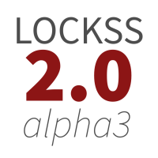

# Version 2.0-alpha3 of the LOCKSS system has not yet been released. This page is under construction.

**Release date: (under development)**

*Last updated: 2020-10-20*

The LOCKSS Program is pleased to announce that **LOCKSS 2.0-alpha3**, the third publicly available prototype of its next-generation distributed digital preservation software suite, is now available for testing. *LOCKSS 2.0-alpha3 is a technology preview, not intended for production installations.* **Version 2.0-alpha3 of the LOCKSS system has not yet been released. This page is under construction.**

## What's New?

*   The system's [Docker](https://www.docker.com/) containers are now managed by [MicroK8s](https://microk8s.io/), a lightweight [Kubernetes](https://kubernetes.io/) environment by Ubuntu makers Canonical, rather than Docker Swarm.
*   Design and performance improvements to the repository layer, including support for multiple disk storage volumes (in preparation for migrating existing LOCKSS boxes, many of which have multiple disk storage volumes).
*   The `runcluster` development environment can be used to run a lightweight LOCKSS system from JAR artifacts built locally from the Git codebase or retrieved from Maven Central or Sonatype OSSRH.
*   Infrastructure for building LOCKSS plugins in the LAAWS environment.
*   IP filtering for REST endpoints (similar to IP filtering for the LOCKSS Web user interface).
*   Bugfixes and performance improvements throughout the system.

## Installation

In order to install the LOCKSS 2.0-alpha3 system, you will need:

*   64-bit **Linux host** (physical or virtual) with at least 4 cores, 8 GB of memory and 50 B of disk space.
*   **MicroK8s** (a lightweight Kubernetes environment), which requires **Snap** (an application package manager).
*   **Git** (to download the `lockss-installer` project from GitHub).

For detailed installation instructions, see the [**Installing the LOCKSS System**](../manual/2.0-alpha3/installing) section in the [**LOCKSS System Manual**](../manual/2.0-alpha3).

## Upgrade

If you were running LOCKSS 2.0-alpha2, you no longer need Docker[1](#f1) nor Java 8 installed on the host machine.

For detailed installation instructions, see the [**Upgrading From LOCKSS 2.0-alpha1**](../manual/2.0-alpha3/upgrading) section in the [**LOCKSS System Manual**](../manual/2.0-alpha3).

## Contact Us

Please contact us for questions, feedback and bug reports. Open a ticket by sending e-mail to `lockss-support` (at) `lockss` (dot) `org`. Your contribution toward the final LOCKSS 2.0 release is very important to us and greatly appreciated by the community.

## Versions

The LOCKSS 2.0-alpha3 system consists of a configurable set of the following components:

*   [LOCKSS Configuration Service](https://github.com/lockss/laaws-configservice) version 2.0.4.0
*   [LOCKSS Repository Service](https://github.com/lockss/laaws-repository-service) version 2.0.10.0
*   [LOCKSS Metadata Extraction Service](https://github.com/lockss/laaws-metadataextractor) version 2.0.3.0
*   [LOCKSS Metadata Service](https://github.com/lockss/laaws-metadataservice) version 2.0.2.0
*   [LOCKSS Poller Service](https://github.com/lockss/laaws-poller) version 2.0.2.0
*   [PostgreSQL](https://www.postgresql.org/) version 9.6.12
*   [Apache Solr](https://lucene.apache.org/solr/) version 7.2.1
*   [Pywb](https://github.com/webrecorder/pywb) version 2.2.20190410
*   [OpenWayback](https://github.com/iipc/openwayback) version 2.4.0-1

## Frequently Asked Questions

**I have an existing classic LOCKSS system (version 1.x). Can I upgrade to LOCKSS 2.0-alpha3?**

The LOCKSS 2.0-alpha3 release is a technology preview which we are excited to share with the community for testing purposes. It is not yet possible to convert from a classic LOCKSS system (e.g. version 1.74.10) to a LOCKSS 2.0 system. To help us advance toward the final LOCKSS 2.0 release, please consider installing and running the LOCKSS 2.0-alpha3 release on a test machine and [providing us with your feedback](#contact-us).

**I have a LOCKSS system running 2.0-alpha2. Can I upgrade to LOCKSS 2.0-alpha3?**

Yes. You are welcome to wipe your testing data from LOCKSO 2.0-alpha2 and start from scratch, but there is an [upgrade](#upgrade) path from LOCKSS 2.0-alpha2.

**Can I use my own PostgreSQL database?**

Yes, you can run the included PostgreSQL database, or configure it to use your local or institutional PostgreSQL database.

**Can I use my own Solr database?**

Yes, likewise, you can run an included Solr database, but you can can also configure it to use your local or institutional Solr database.

**Can I replay Web content with my own Pywb instance?**

Yes, you can configure your own Pywb instance to connect directly to the LOCKSS Repository Service, or you can use the included Pywb instance, or you might choose not to run Pywb at all.

**Can I replay Web content with my own OpenWayback instance?**

Yes, you can configure your own OpenWayback instance to connect directly to the LOCKSS Repository Service, or you can use the included OpenWayback instance, or you might choose not to run OpenWayback at all.

----

#### Footnotes

<a name="f1" id="f1">[1]</a> The system's containers are generated by Docker in development, which produces containers that run on `containerd` at runtime. In previous releases, they were also orchestrated by Docker Swarm at runtime, so Docker was required on host machines. Starting with this release, the containers are orchestrated by Kubernetes at runtime instead, so Docker is not required on host machines.
