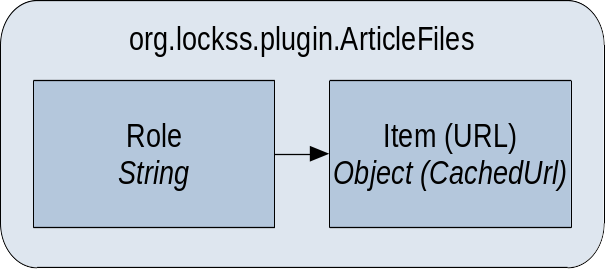

*This page is under construction.*

**This page is part of the [LOCKSS Plugin Developer Manual](/developers/plugin/).**

## Key

Key: `plugin_article_iterator_factory`

## Value Type

Value type: string (`<string>`)

The string is the fully-qualified name of a Java class implementing the **`org.lockss.plugin.ArticleIteratorFactory`** interface.

Example:

```xml
  <entry>
    <string>plugin_article_iterator_factory</string>
    <string>edu.example.plugin.publisherx.PublisherXArticleIteratorFactory</string>
  </entry>
```

## Description

At its core, the `ArticleIteratorFactory` is simple:

```java
public interface ArticleIteratorFactory {

  public Iterator<ArticleFiles> createArticleIterator(ArchivalUnit au,
                                                      MetadataTarget target)
      throws PluginException;

}
```

Its goal is to enumerate the articles (where "article" is meant as "item" or "object") in the archival unit (AU). Each article is represented by an `ArticleFiles` instance.

However, rather than traversing the AU's URLs manually through the `ArchivalUnit` interface and implementing typical inner workings of a Java `Iterator`, many article iterators make use of utility classes available in the LOCKSS software, such as `SubTreeArticleIterator` and `SubTreeArticleIteratorBuilder`.

## `ArticleFiles`

An `ArticleFiles` instance groups the main URLs of an article (item) together and labels them. It is a mapping from **roles** to URLs (which are internally represented as objects implementing `org.lockss.plugin.CachedUrl`). (Technically, it is a mapping from roles to arbitrary Java objects.)



Roles are arbitrary strings, but many typical role strings are defined as constants in the `ArticleFiles` class, for example:

*   Full text URLs:

    *   `ArticleFiles.ROLE_FULL_TEXT_HTML`: a URL for the full text of a work, in HTML form

    *   `ArticleFiles.ROLE_FULL_TEXT_PDF`: a URL for the full text of a work, in PDF form

    *   `ArticleFiles.ROLE_FULL_TEXT_EPUB`: a URL for the full text of a work, in EPUB form

    *   `ArticleFiles.ROLE_FULL_TEXT_XML`: a URL for the full text of a work, in XML form

*   `ArticleFiles.ROLE_ABSTRACT`: a URL for a work's abstract

*   `ArticleFiles.ROLE_REFERENCES`: a URL for a work's list of works cited

*   `ArticleFiles.ROLE_FIGURES`: a URL for a landing page of the work's figures and illustrations

*   `ArticleFiles.ROLE_TABLES`: a URL for a landing page of the work's tables

*   `ArticleFiles.ROLE_SUPPLEMENTARY_MATERIALS`: a URL for a landing page of the work's supplementary materials

*   Citation URLs:

    *   `ArticleFiles.ROLE_CITATION`: a URL for a landing page or the work's citation files

    *   `ArticleFiles.ROLE_CITATION_BIBTEX`: a URL for a BibTeX citation file for the work

    *   `ArticleFiles.ROLE_CITATION_ENDNOTE`: a URL for an EndNote citation file for the work

    *   `ArticleFiles.ROLE_CITATION_RIS`: a URL for a RIS citation file for the work

*   `ArticleFiles.ARTICLE_METADATA`: a URL from which metadata for the work can be found

In addition to the mapping from roles to URL, one URL has a special status in the `ArticleFiles` instance as the designated, "best" full text URL for the work. It is set via the `setFullTextCu(...)` method. In plugins written by the LOCKSS Program, for articles with multiple full text representations, typically HTML is favored above all, then PDF, then EPUB, and lastly XML (in subjective order of richness of rendering experience in a browser).

## `SubTreeArticleIterator`

The **`org.lockss.plugin.SubTreeArticleIterator`** class implements `Iterator<ArticleFiles>` and can be returned by an article iterator factory. It traverses an AU's URLs, restricting them in various ways according to a specification. These restrictions include considering only certain subdirectory trees (hence the name), applying regular expressions, selecting a media type, or applying a custom condition.

The **`SubTreeArticleIterator.Spec`** class contains the specification:

*   The specification identifies **root URLs**, limiting which AU URLs are enumerated to those under these root URLs only. This restriction applies to the directory structure, not the URL strings -- in effect, root URLs end with a slash. Root URLs can be specified directly with `setRoot(...)` or `setRoots(...)`, or via printf templates (which expand to URLs) expressed as single Java strings, with `setRootTemplate(...)` or `setRootTemplates(...)`. The printf templates are expressed as single Java strings, which can be tricky to read, for example: `"\"%s%s/%d/\", base_url, journal_id, year"` (with the convention that the base URL value ends with a slash). If the specification specifies no root URL, all URLs in the AU are enumerated.

*   The specification can optionally have an **include pattern** or an **exclude pattern**. With an include pattern, URLs below each root URL that match the include pattern are considered (but others are ignored). With an exclude pattern, URLs below each root URL that match the exclude pattern are ignored (but others are considered). No error will happen if both are specified, but the exclude pattern will be ignored in favor of the include pattern. These patterns (regular expressions) can be specified directly with `setIncludeSubTreePattern(...)` or `setExcludeSubTreePattern(...)`, or via printf templates (which expand to regular expressions) expressed as single Java strings with `setIncludeSubTreePatternTemplate(...)` or `setExcludeSubTreePatternTemplate(...)`.

*   The specification can optionally have a **general pattern**, which is a regular expression applied to any URL still under consideration. It can be specified directly with `setPattern(...)`, or via a printf template (which expands to a regular expression) expressed as a single Java string with `setPatternTemplate(...)`.

*   The specification can have an optional media type (for example `text/html`), and only URLs under consideration that have this media type will be enumerated. *There is currently no way to specify multiple media type, which can be problematic for media types with multiple common representations, like `text/xml` vs. `application/xml`. The class could be enhanced in the future to allow multiple media types.*

The logic for which URLs are enumerated is found in the `isArticleCu(...)` method, which can be customized in a subclass.

By default, for each successful URL, this iterator makes one `ArticleFiles` instance that has its designated full text URL set, and no roles set. This behavior can be customized in `visitArticleCu(...)` and `createArticleFiles(...)` in a subclass.

## `SubTreeArticleIteratorBuilder`

*This section is under construction*
