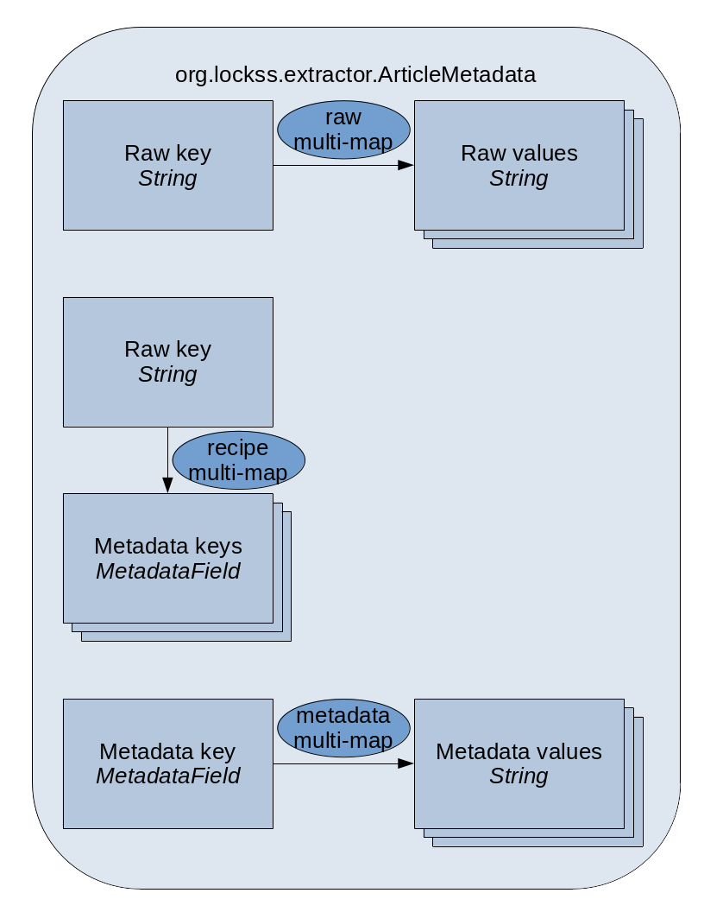

**This page is part of the [LOCKSS Plugin Developer Manual](/developers/plugin/).**

## Key

Key: `plugin_article_metadata_extractor_factory`

## Value Type

Value type: string (`<string>`)

The string is the fully-qualified name of a Java class implementing the `org.lockss.extractor.ArticleMetadataExtractorFactory` interface.

## Example

Plugin XML file:

```xml
  <entry>
    <string>plugin_article_metadata_extractor_factory</string>
    <string>edu.example.plugin.publisherx.PublisherXArticleMetadataExtractorFactory</string>
  </entry>
```

Corresponding Java class:

```java
package edu.example.plugin.publisherx;

import org.lockss.extractor.ArticleMetadataExtractorFactory;

public class PublisherXArticleMetadataExtractorFactory
    implements PublisherXArticleMetadataExtractorFactory {
  // ...
}
```

## Description

The article metadata extractor is part of the [metadata extraction](metadata-extraction) pipeline. Its function is to process each article (where "article" is meant as "item" or "object") in the archival unit (AU) and emit any number of metadata records from it. Each metadata record is represented by an `ArticleMetadata` instance.

The **`org.lockss.extractor.ArticleMetadataExtractorFactory`**, **`org.lockss.extractor.ArticleMetadataExtractor`** and **`org.lockss.extractor.ArticleMetadataExtractor.Emitter`** interfaces are as follows:

```java
public interface ArticleMetadataExtractorFactory {

  public ArticleMetadataExtractor createArticleMetadataExtractor(MetadataTarget target)
      throws PluginException;

}

public interface ArticleMetadataExtractor {

  public interface Emitter {

    public void emitMetadata(ArticleFiles af,
                             ArticleMetadata metadata);

  }

  public void extract(MetadataTarget target,
                      ArticleFiles af,
                      Emitter emitter)
      throws IOException, PluginException;

}
```

### ArticleMetadata

An **`org.lockss.extractor.ArticleMetadata`** object contains two multi-maps (one-to-many mappings, using the Apache Commons Collections `org.apache.commons.collections.map.MultiValueMap` class internally): a **raw multi-map**, and a **metadata multi-map** often called the **cooked multi-map** by analogy. The raw multi-map is for general-purpose storage of data extracted from content, where the keys are arbitrary strings, and the multiple values are either strings or maps from string to string. The cooked multi-map is the final representation of the metadata information contained in the object, where the keys are `MetadataField` instances, and the multiple values are strings.

**`org.lockss.extractor.MetadataField`** objects represent not only the key of a metadata field but also its cardinality (single or multiple) and a validator. Many are built into the `MetadataField` class itself, including single cardinality fields for journal volume, issue, start page and end page; single cardinality fields for DOI, ISSN, eISSN, ISBN that accept a string potentially prefixed with doi:, issn:, eissn: and isbn: (as is often found on publisher websites); multiple cardinality fields for authors; etc.

The plugin-dependent way to populate the cooked multi-map from the raw multi-map is given by a **recipe multi-map** sometimes confusingly referred to as the **cook map**, which maps raw keys (string) to one or more cooked keys (`MetadataField`). For each raw key-cooked key pair, each raw multi-value corresponding to the raw key is validated and stored by the cooked field into a cooked multi-value.

These mappings can be represented like so:



### BaseArticleMetadataExtractor

Most plugins do not implement arbitrary logic in the article metadata extractor, but simply use the **`org.lockss.extractor.BaseArticleMetadataExtractor`** class.

This utility article metadata extractor is parameterized with a single target `ArticleFiles` role, parses the URL in the `ArticleFiles` that has the target role using the appropriate file metadata extractor for its media type, and post-processes each emitted `ArticleMetadata` object by adding bibliographic metadata drawn from the AU's listing in the title database (AU inventory) if such data is not extracted from the content already.

The logic for what gets post-processed from the title database into the `ArticleMetadata` instance is in the `addTdbDefaults(...)` method, which can be overridden to customize. If the AU is not labeled as bulk content (disparate content from many sources), the publication type, series name, ISSN, eISSN, ISBN, eISBN, publication name, volume, issue, and publication date are set from the corresponding value in the title database, if available and if not already set from the actual metadata extraction.

Additionally, the `checkAccessUrl(...)` method ensures that the URL set under the `MetadataField.FIELD_ACCESS_URL` metadata key for the article is actually in the AU, and if not, it is reset to the full text URL for the article.

The implementation of `ArticleMetadataExtractorFactory` is often simply to return a new `BaseArticleMetadataExtractor` for a given target role (usually `ArticleFiles.ARTICLE_METADATA`), with no further code:

```java
  @Override
  public ArticleMetadataExtractor createArticleMetadataExtractor(MetadataTarget target)
      throws PluginException {
    return new BaseArticleMetadataExtractor(ArticleFiles.ROLE_ARTICLE_METADATA);
  }
```

Because of this, many plugins do not define a separate Java class for the article metadata extractor factory but simply let their article iterator factory also implement `ArticleMetadataExtractorFactory`:

```java
public class PublisherXArticleIteratorFactory
    implements ArticleIteratorFactory, ArticleMetadataExtractorFactory {

  @Override
  public Iterator<ArticleFiles> createArticleIterator(ArchivalUnit au,
                                                      MetadataTarget target)
      throws PluginException {
    // ...
  }

  @Override
  public ArticleMetadataExtractor createArticleMetadataExtractor(MetadataTarget target)
      throws PluginException {
    return new BaseArticleMetadataExtractor(ArticleFiles.ROLE_ARTICLE_METADATA);
  }

}
```
