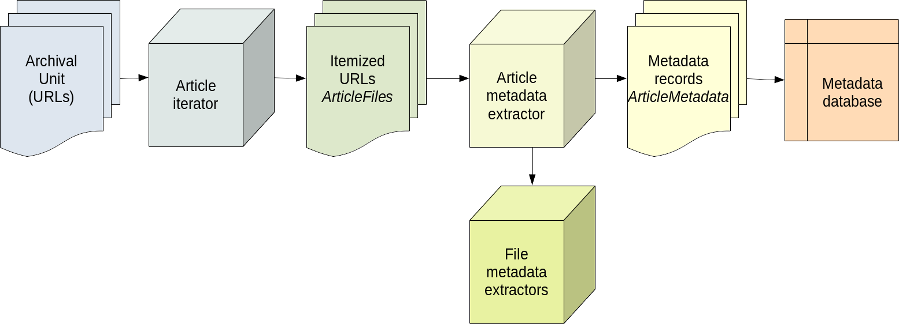

*This page is under construction.*

**This page is part of the [LOCKSS Plugin Developer Manual](/developers/plugin/).**

Once content is successfully crawled into an archival unit (AU) in a LOCKSS node, optionally with the help of hash filters and related plugin features, the AU is preserved by polling and repairing with other nodes in the network holding the same AU. If metadata extraction from preserved data is desired beyond the preservation of the data itself, the plugin needs to specify **metadata extraction** features (and enable the **metadata database** in the node).

Metadata extraction relies on a trio of related concepts: an article iterator, an article metadata extractor, and file metadata extractors (where "article" is meant in the sense of "item" or "object").

*   The **article iterator** receives select URLs from the AU, and groups them into distinct articles (items, objects). Each group of URLs belonging to a given article in the AU is represented as an object of type `org.lockss.plugin.ArticleFiles`, which is a mapping from **roles** to URLs. Roles are simply strings.

*   The **article metadata extractor** receives each article's `ArticleFiles` group, and emits any number of metadata records. A metadata record is represented as an object of type `org.lockss.extractor.ArticleMetadata`, which consists of raw metadata (stored as a one-to-many mapping of strings) and a recipe to produce a one-to-many mapping from **metadata fields** to processed metadata values. Metadata fields are an abstraction to specify cardinality and validation constraints on metadata values.

*   The article metadata extractor obtains raw metadata by selecting URLs from the `ArticleFiles` and submitting their contents to a **file metadata extractor** suitable for the URL's media type or file format.

This process can be summarized in the following diagram:

