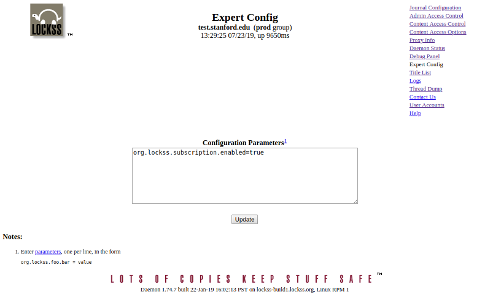
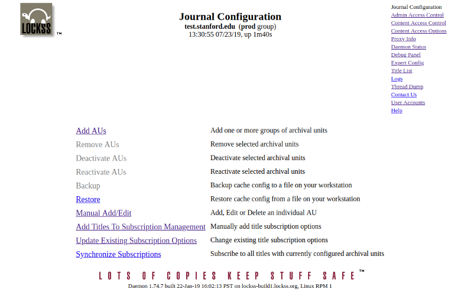

To get back to the Classic LOCKSS Homepage use [this link](../index.md)

## Overview

This document explains how to enable Subscription Management to simplify the process of adding Archival Units of serial publications. 

_Please note that the terms **Subscription Management** and **Subscription Manager** will be used interchangeably through out this document._

## Why Subscription Management is Important

When New Archival Units become available for preservation, an administrator needs to manually add them to the list of Archival Units to be preserved by a LOCKSS system. This is accomplished by going to the "**Add AUs**" link in the "**Journal Configuration**" page of the LOCKSS Administration web interface. Each new version of Archival Units also needs to be added to the machine manually.

Subscription Manager allows for serial publications to be more efficiently added to a LOCKSS system in bulk by allowing administrators to specify a subscription period when the Library is subscribed to the publications and then the LOCKSS software configures the associated Archival Units automatically. 
- _**Please Note**_ in the context of the LOCKSS software the term “**subscription**” does not directly refer to the agreement between the Library and the serial publication publisher regarding the purchase of content published in the serial publication.
Instead, it refers to Archival Units in the LOCKSS system and addresses the question of whether Archival Units that become available for preservation should be configured in LOCKSS to get them preserved.

## Enabling Subscription Manager

Subscription manager is disabled by default in all new LOCKSS systems. In order to enable it you must first navigate to "**Expert Config**" and add the parameter ```org.lockss.subscription.enabled=true```. Click on the "Update" button to make the change take effect. 

<kbd></kbd>

After entering the org.lockss.subscription.enabled=true parameter and clicking "update", it is necessary that we restart the LOCKSS Daemon. 

- Redhat 6 variant ```service lockss restart```
- Redhat 7 variant ```systemctl restart lockss```

## Verify Subscription Management is Enabled

Now that we have restarted the LOCKSS Daemon, navigate to the "**Journal Configuration**" page. You should see three new options near the bottom of the page that are directly related to the Subscription Manager

- _Add Titles to Subscription Management_
- _Update Existing Subscription Options_
- _Synchronize Subscriptions_


<kbd></kbd>

## Using Subscription Management

For information on using the Subscription manager, please visit [**Configuring Subscription Management**](../subscription-manager/index.md)

On that page you will learn about:
- Subscription Synchronization
- Adding New Subscriptions
- Updating Existing Subscriptions
- Subscription Specification Details
- Limitations of the System 


## News

*   **2019-05-13** - **LOCKSS 2.0-Alpha Available for Testing** - The LOCKSS Program is pleased to announce that LOCKSS 2.0-alpha is now available for testing. [**Read more...**](releases/2.0-alpha)

*   **2019-04-05** - **LOCKSS 2.0-Alpha Technology Preview** - At the 2019 LOCKSS Alliance Meeting, the LOCKSS engineering team presented a Technology Preview of the upcoming LOCKSS 2.0-alpha release. [**Read more...**](releases/2.0-alpha-preview)
